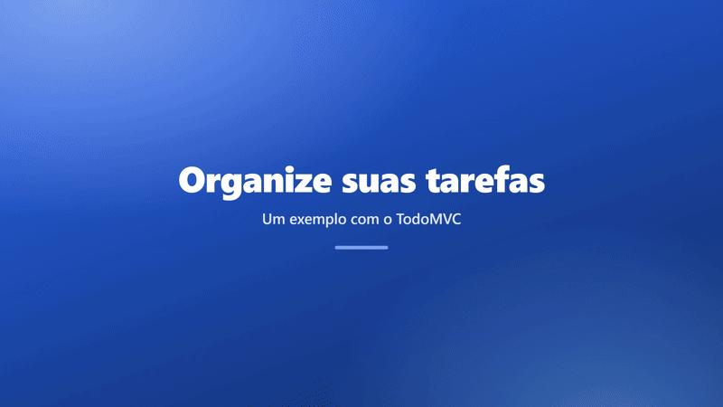
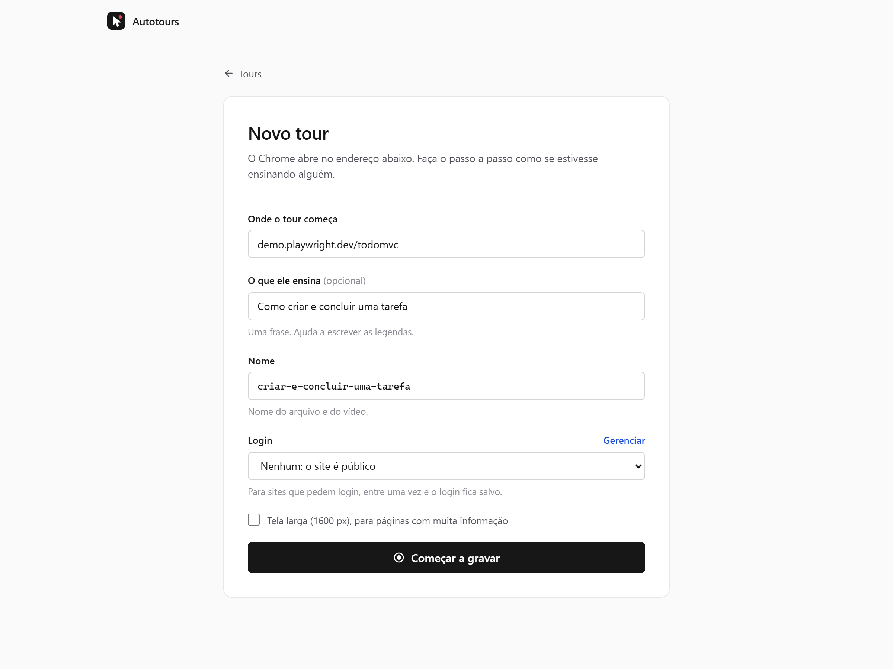
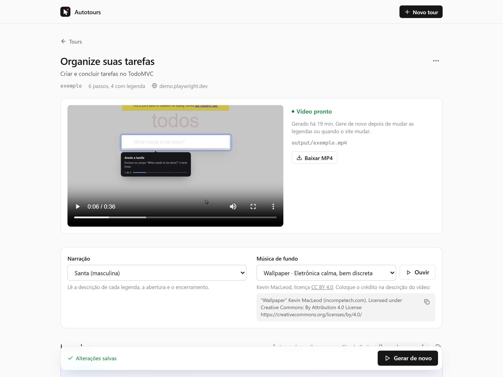

<div align="center">

# Autotours

**Grave tours em vídeo de qualquer site.**<br>
Você faz o passo a passo no Chrome; sai um MP4 com cursor animado, legendas, zoom e narração.




</div>

## Veja em 2 minutos

<!-- Troque a linha abaixo pelo link que o GitHub gera ao arrastar o apresentacao.mp4 para este editor. -->

VIDEO_APRESENTACAO

<sub>Este vídeo foi gravado com o próprio Autotours.</sub>

## Como funciona

1. **Grave.** Informe o endereço do site e faça o passo a passo numa janela do Chrome, como se estivesse ensinando alguém.
2. **Revise as legendas.** Cada passo vira uma legenda editável, ao lado da tela daquele momento. O Claude Code pode reescrevê-las por você.
3. **Gere o vídeo.** O Chrome refaz tudo sozinho, sem publicar nada de novo no site, e o resultado sai em MP4 de 1920 px.

| Gravar                                                                                                        | Revisar e gerar                                                                                            |
| ------------------------------------------------------------------------------------------------------------- | ---------------------------------------------------------------------------------------------------------- |
|  |  |

## Recursos

- **Cursor animado** com clique visível e atalhos de teclado exibidos na tela.
- **Legendas numeradas** ao lado de cada elemento, com a câmera aproximando da ação.
- **Narração** em português com [Piper](https://github.com/rhasspy/piper) (offline) ou [Kokoro](https://github.com/remsky/Kokoro-FastAPI) (em Docker), escolhida no editor.
- **Telas de abertura e encerramento** nas cores da sua marca.
- **Música de fundo** escolhida numa lista de músicas com licença de uso, ou um arquivo seu.
- **Popups** (login com Google, pagamento) mostrados como janelas dentro do vídeo.
- **Sites com login:** você entra uma vez numa janela do Chrome e o login fica salvo.
- **Nada é publicado duas vezes:** o que a gravação criou ou alterou é respondido com a resposta gravada quando o vídeo é gerado.
- **Refaça quando o site mudar:** o roteiro fica salvo em JSON, e o vídeo pode ser gerado de novo quantas vezes quiser.

## Começando

Você precisa de:

- [Node.js](https://nodejs.org) 24 ou mais novo e [pnpm](https://pnpm.io);
- [Google Chrome](https://www.google.com/chrome/), usado pelo Playwright (nenhum outro navegador é baixado);
- [ffmpeg](https://ffmpeg.org/download.html) 7 ou mais novo, no `PATH`.

```sh
git clone https://github.com/SEU-USUARIO/autotours.git
cd autotours
pnpm install
pnpm setup:piper   # instala a voz da narração (~85 MB, em .cache/)
pnpm ui            # abre a interface em http://localhost:4321
```

Para ver tudo funcionando antes de gravar, abra o tour **Organize suas tarefas** (um exemplo sobre o [TodoMVC](https://demo.playwright.dev/todomvc/)) e clique em **Gerar vídeo**.

## Usando

### Gravar

Clique em **Novo tour** e informe:

- **Onde o tour começa:** o endereço inicial.
- **O que ele ensina** (opcional): uma frase que ajuda a escrever as legendas.
- **Nome:** vira o nome do arquivo e do vídeo.

O Chrome abre nesse endereço. Faça o passo a passo e clique em **Parar gravação** (ou feche a janela).

São gravados cliques, digitação, teclas e atalhos, seleções, checkboxes, envio de arquivos e popups. A rolagem até cada elemento é automática.

### Sites com login

No campo **Login**, escolha **Entrar em um site…**. O Chrome abre na página de login e você entra como sempre, inclusive com verificação em duas etapas. O login fica salvo neste computador e é usado na gravação e na geração do vídeo. Se um dia o vídeo mostrar a tela de login, o login expirou: entre de novo.

> Prefira uma conta de teste: o que você faz durante a gravação acontece de verdade no site, uma vez. Login com Google ou Microsoft pode ser recusado num navegador automatizado; nesse caso, entre com e-mail e senha do próprio site.

### Legendas

As legendas nascem do nome de cada elemento (“Clique em “Salvar””). Edite o título e a descrição de cada passo no editor; tudo é salvo sozinho. A descrição é também o que a narração lê.

Para legendas que expliquem o fluxo, use o [Claude Code](https://claude.com/claude-code) nesta pasta:

```
/legendas nome-do-tour
```

Ele lê o objetivo, as telas de cada passo e o roteiro, reescreve as legendas, a abertura e o encerramento sem mexer nas ações, e aponta os passos que podem quebrar o vídeo. A interface mostra as legendas novas assim que o arquivo muda.

### Gerar o vídeo

Clique em **Gerar vídeo**. O progresso aparece na página e o vídeo fica em `output/<nome>.mp4`. Se algum passo falhar, a mensagem diz o alvo, a causa provável e mostra a tela do momento. O [formato do roteiro](docs/roteiro.md#quando-o-vídeo-falha) explica as falhas mais comuns.

## Segurança e privacidade

- Tudo roda na sua máquina; a interface só responde em `localhost`.
- Senhas digitadas durante a gravação não vão para o roteiro.
- `sessions/` guarda os cookies dos seus logins, e `mocks/` e `captures/` podem conter dados da sua conta. Essas pastas e as suas gravações em `tours/` ficam fora do git; só os exemplos vão junto.
- Requisições que alteram dados (POST, PUT, PATCH, DELETE) nunca chegam ao site durante a geração do vídeo: recebem a resposta gravada ou uma resposta vazia. Leituras e conexões em tempo real continuam indo ao site.

## Linha de comando

A interface é o caminho principal, mas os mesmos passos existem no terminal:

| Comando                                                                                | O que faz                                          |
| -------------------------------------------------------------------------------------- | -------------------------------------------------- |
| `pnpm ui [--port 4321] [--no-open]`                                                    | Abre a interface                                   |
| `pnpm session <nome> <url>`                                                            | Abre o Chrome para entrar num site e salva o login |
| `pnpm record <nome> <url> [--session <login>] [--goal "..."] [--width 1600] [--force]` | Grava um tour                                      |
| `pnpm play <nome> [--keep-frames]`                                                     | Gera o vídeo de `tours/<nome>.json`                |
| `pnpm setup:piper [voz]`                                                               | Instala o Piper e uma voz                          |

## Configuração

O `tour.config.ts` vale para todos os tours:

```ts
import type { TourConfig } from "./src/config.ts";

export default {
  locale: "pt-BR", // idioma do navegador e das legendas geradas
  colorScheme: "light",
  theme: { primary: "#2563eb", accent: "#f97316" }, // legendas e telas de abertura
  voice: { provider: "piper", model: "pt_BR-faber-medium" },
  // music: { track: "easy-lemon", volume: 0.15 }, // ou { file: "assets/musica.mp3" }
} satisfies TourConfig;
```

## Documentação

- [Formato do roteiro](docs/roteiro.md): campos, passos, mocks e o que fazer quando o vídeo falha.
- [Narração e música](docs/narracao.md): vozes do Piper e do Kokoro, as músicas com licença e como criar um provedor de voz.
- [Arquitetura](docs/arquitetura.md): como o código está organizado.

## Contribuindo

Issues e pull requests são bem-vindos. Antes de abrir um PR:

```sh
pnpm typecheck
pnpm test        # testes rápidos
pnpm test:e2e    # grava um site de teste e gera o vídeo (precisa do Chrome, ffmpeg e Piper)
```

## Licença

[MIT](LICENSE)
